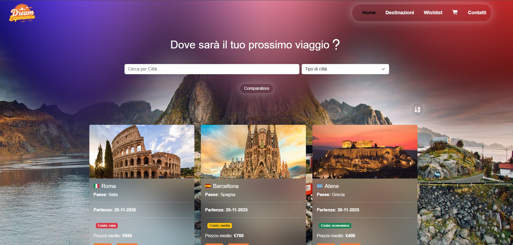
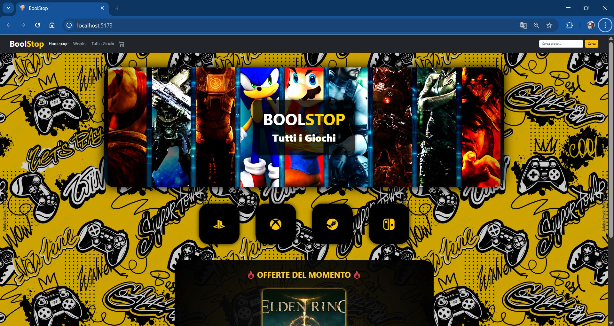

# Hi, I'm Giulio 👋

### Junior Front-End Developer · UI/UX Enthusiast · Industrial Designer turned Coder

_I build clean, fast and intuitive web experiences — where design thinking meets modern frontend engineering._

> 🟢 **Open to work** — Available immediately, full remote worldwide or on-site near Lecce, Italy

---

## About me

I come from an unusual path: a degree in **Industrial Design** at Politecnico di Bari, years building and running businesses in Italy and the UK, and then a deliberate choice to become a developer. I completed a **Full Stack Master at Boolean** in 2025, specialising in React and TypeScript.

The design background isn't a detour — it's an asset. I read wireframes, think in user flows, and translate design intent into pixel-perfect, accessible interfaces. Code and design aren't separate worlds to me.

---

## 🛠 Tech Stack

**Frontend**

**Backend & Database**

**Tools & Concepts**

**Design**

---

## 📂 Featured Projects

|                                                                                                       🌍 DreamExperience                                                                                                       |                                                                                                 🕹️ BoolStop                                                                                                 |
| :----------------------------------------------------------------------------------------------------------------------------------------------------------------------------------------------------------------------------: | :---------------------------------------------------------------------------------------------------------------------------------------------------------------------------------------------------------: |
|                                                                                                                                                                          |                                                                                                                                                               |
| **Travel Comparator Platform** built with React.js + TypeScript. Complex REST API integration, global state with Context API (cart, wishlist, sorting), performance optimised with `useCallback` / `useMemo`, built with Vite. | **Gaming E-Commerce Platform** — full-stack project built in 2 weeks with an Agile team. Express.js REST API, MySQL database, React.js frontend with Bootstrap. Focus on UX/UI and real-world product flow. |
|                                                                                      `React.js` `TypeScript` `Context API` `Vite` `CSS3`                                                                                       |                                                                           `React.js` `Express.js` `MySQL` `Bootstrap` `REST API`                                                                            |
|                                [🔗 Live Demo](https://progetto-finale-spec-frontend-front-theta.vercel.app/) · [💻 Code](https://github.com/GiulioAgnello/progetto-finale-spec-frontend-front)                                 |                                     [💻 Frontend](https://github.com/GiulioAgnello/BoolStopFrontEnd) · [💻 Backend](https://github.com/GiulioAgnello/boolstop_express)                                      |

---

## 📊 GitHub Stats

---

_"Design is not just what it looks like. Design is how it works."_ — Steve Jobs

