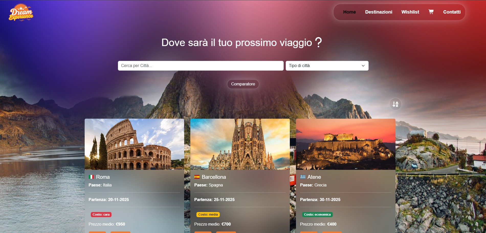
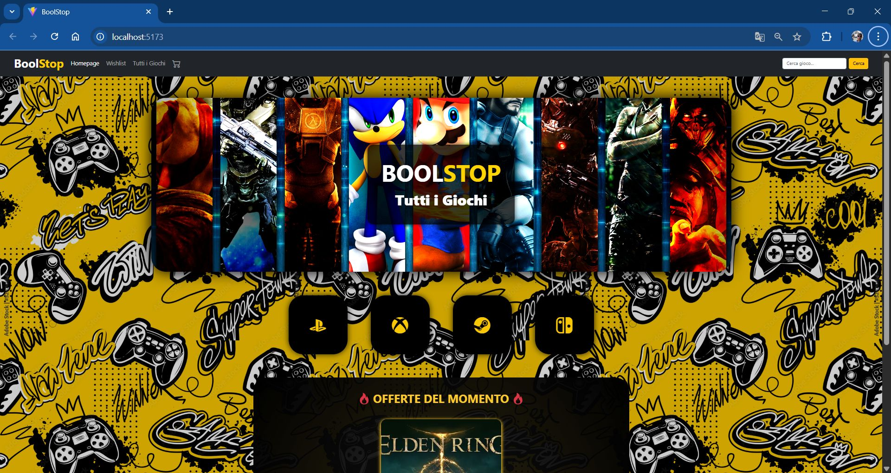
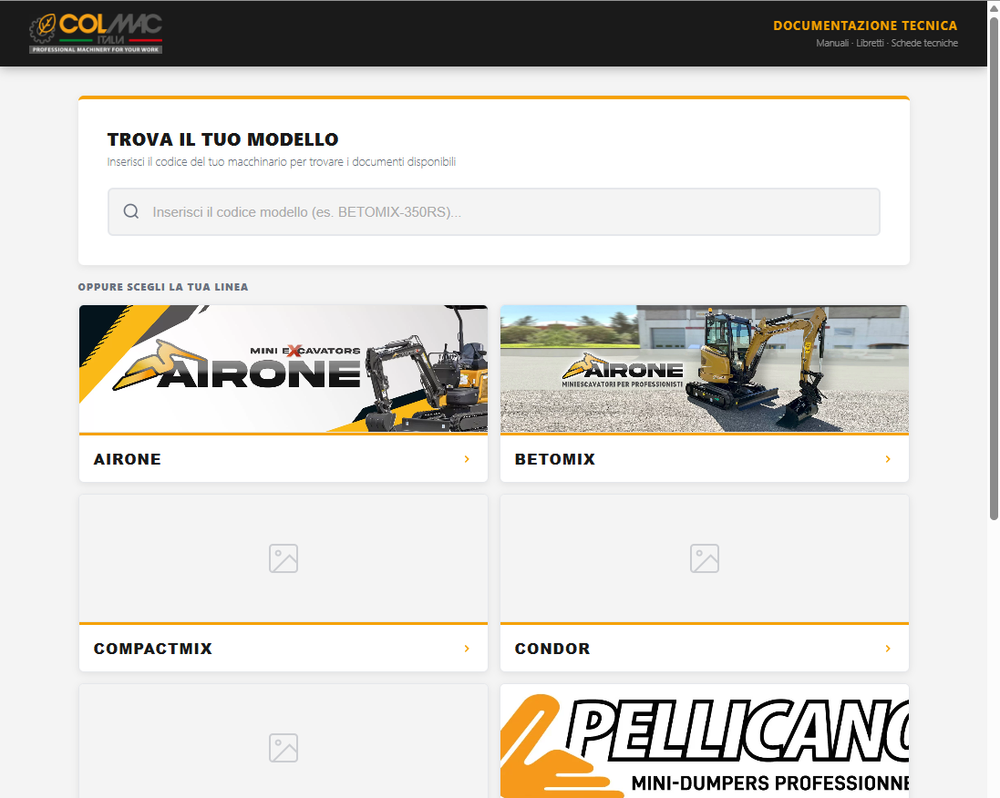

# 👋 Hi, I'm Giulio Agnello

### 💻| FullStack Dev | Front-End Developer | 🎨 UI/UX Enthusiast | 🚀 Curious Mind

Passionate about building clean, intuitive and elegant digital experiences.

Amo progettare interfacce che parlano da sole, combinando **design**, **logica** e **performance**.  
Dopo una laurea in _Industrial Design_, ho ampliato le mie competenze nel mondo del **web development** con _Boolean_, creando progetti sempre più complessi e connessi.

---

## 🚀 Tech Stack

**Frontend:**  
React.js · Angular.js · Vite · JavaScript · TypeScript · HTML5 · CSS3 · Bootstrap

**Backend**

Express.js · mySQL · C# · .NET · SQLite

**Tools & Concepts:**  
REST API · Context API · Hooks (useMemo, useCallback, useEffect) · Routing · LocalStorage · Git & GitHub

**Design:**  
 UI Components · Responsive Design · UX Patterns

---

## 📂 Featured Projects

### 🌍 **DreamExperience – Travel Comparator Platform**

### 🕹️ **BoolStop – Gaming E-Commerce Platform**

|                                                                                   🌍 **[DreamExperience](https://github.com/GiulioAgnello/progetto-finale-spec-frontend-front)**                                                                                   |                                                                                🕹️ **[BoolStop](https://github.com/GiulioAgnello/BoolStopFrontEnd)**                                                                                 |
| :----------------------------------------------------------------------------------------------------------------------------------------------------------------------------------------------------------------------------------------------------------------: | :---------------------------------------------------------------------------------------------------------------------------------------------------------------------------------------------------------------------------------: |
|    Piattaforma per il **confronto di destinazioni di viaggio**, sviluppata in **React.js** con **Context API**, gestione **wishlist & carrello**, **sorting** e ottimizzazioni **useCallback / useMemo**. |    **Gaming e-commerce platform** sviluppata in 2 settimane. Progetto full-stack che unisce **database design**, **server Express.js** e **frontend React.js** con focus su UX/UI. |
|                                                                                                       **🛠 Tech:** React.js, Context API, CSS3, LocalStorage                                                                                                       |                                                                                    **🛠 Tech:** React.js, Express.js, MySQL, Bootstrap, REST API                                                                                    |
|                                                    **🔗 [Demo](https://progetto-finale-spec-frontend-front-theta.vercel.app/) \| [Code](https://github.com/GiulioAgnello/progetto-finale-spec-frontend-front)**                                                    |                                                **🔗 [Frontend](https://github.com/GiulioAgnello/BoolStopFrontEnd) \| [Backend](https://github.com/GiulioAgnello/boolstop_express)**                                                 |

### 🏭 **Colmac-Docs – Industrial Catalog & Document Portal**

### 🏨 **Le Mura degli Angeli – BnB Salento**

| 🏭 **[Colmac-Docs](https://github.com/GiulioAgnello/colmac-manuals)** | 🏨 **[Le Mura degli Angeli](https://github.com/GiulioAgnello/lemura-bnb)** |
| :-------------------------------------------------------------------: | :-------------------------------------------------------------------------: |
|    Portale aziendale per la **gestione di cataloghi e documenti tecnici**. Automazione nel **caricamento e catalogazione** dei file per tipo di macchinario e linea di prodotto, con frontend **React.js** su CMS **WordPress headless**. |    Portale per un **BnB nel Salento** con **booking engine custom**, visualizzazione e prenotazione camere in tempo reale. Architettura **headless WordPress** + **React.js** per massima flessibilità e performance. |
| **🛠 Tech:** React.js, Headless WordPress, REST API, CSS3 | **🛠 Tech:** React.js, Headless WordPress, REST API, CSS3 |
| **🔗 [Live](https://docs.colmac-italia.com/#/) \| [Code](https://github.com/GiulioAgnello/colmac-manuals)** | **🔗 [Live](https://www.lemuradegliangeli.it/) \| [Code](https://github.com/GiulioAgnello/lemura-bnb)** |

---

### 📈 GitHub Stats

---
